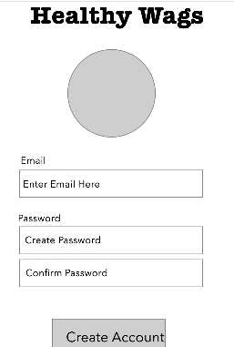
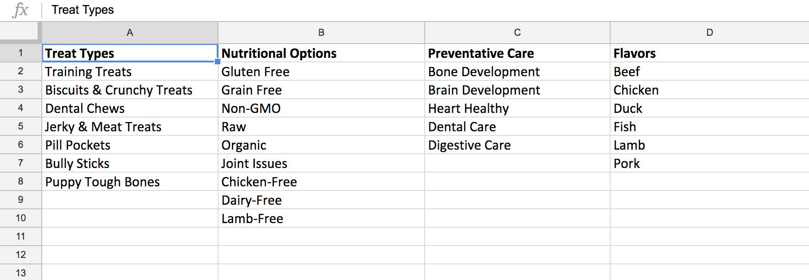
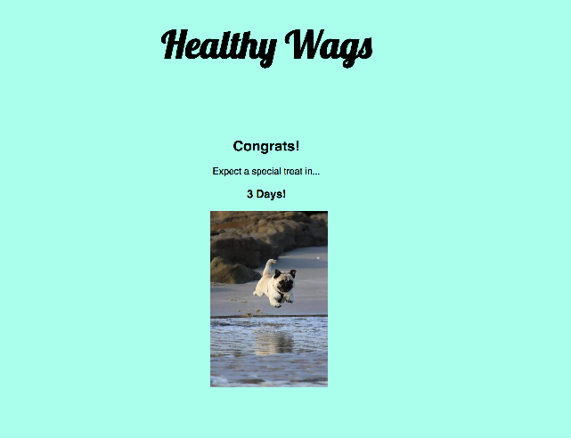
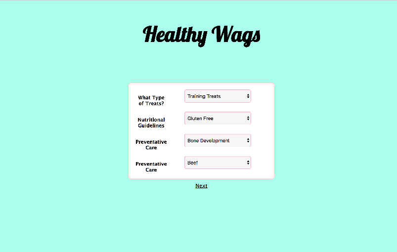
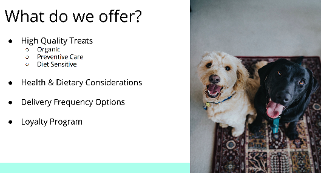

# Assignment
A roughly eight-hour hackathon based on the show Shark Tank. Our team brainstormed a money-making idea then dsigned, developed, and presented an app to showcase its usability. 

# Details
### The Concept
A monthly-subscription service that delivers high-quality treats to health conscious owners or individuals whose pets have specific dietary restrictions.
### The Approach
Our UX designers, Christine Cranston and Meg Durcan, conducted user research to create a list of options that would be important to potential customers. They wireframed the app layout and gave the developers, Taylor Darneille and Jade Rosse, thorough and thoughtful guidelines for front-end application.
### The Development
Taylor and Jade created a MERN stack app comprised of a functioning auth database and flowing frontend using React.js
### The Pitch
Meg and Christine wrote up an engaging script and easy-to-read slides to present the idea and app to a panel of four judges. Taylor and Jade shared some technical details and challenges.
### The Result
After seeing 11 other groups present, we were awarded third place! Post-hackathon, we had experience working on a designer/developer team and made three new friends in the industry.

# Layout
### Wireframes

### User Data

### Finished App

### Presentation

# Technologies Used
* Mongodb
* Express
* React
* Node.js
* RESTful API
* Cloudinary widget

